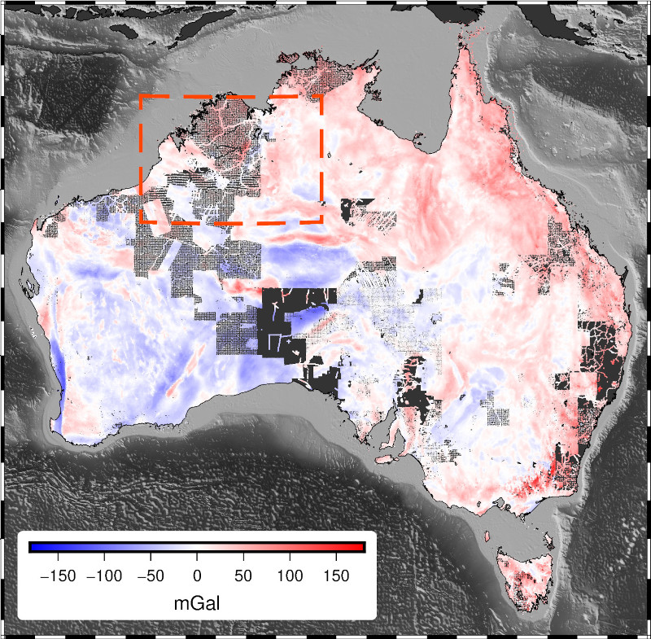

<!-- .slide: class="slide-title" -->

# Methodologies and computational tools for processing and modelling gravity data

## [Santiago Soler](https://www.santisoler.com)

[*CONICET, Argentina*](https://www.conicet.gov.ar/)
 
[*Instituto Geofísico y Sismológico Volponi, UNSJ, Argentina*](http://igsv.unsj.edu.ar/)
 
[*Computer-Oriented Geoscience Lab*](https://www.compgeolab.org/)

---

# About me

* Licentiate en Physics (UNR)
* PhD Student in Geophysics (UNSJ)
* CONICET scholarship
* Developer of [Fatiando a Terra](https://www.fatiando.org)
* Member of the [Computer-Oriented Geoscience Lab](https://www.compgeolab.org)

---

# Advisor: Mario Giménez

Researcher at CONICET and  at Instituto Geofísico Sismológico Volponi

---

# Co-advisor: Leonardo Uieda

Lecturer in Geophysics at University of Liverpool 
Head of the Computer-Oriented Geoscience Lab 
Core developer of the Fatiando a Terra project 

---

# Goals

- Gravitational effects of tesseroids with variable density
- Interpolation of very large gravity datasets through equivalent sources
- Open-source software implementations

---

# What is gravity data?

---

# Gravity surveys

Ground survey

Airborne survey

---

# Gravity surveys

- Unevenly distributed
- Variable observation height

---

# Interpolating gravity data

<dl>
    <dt>Interpolation:</dt>
    <dd>Predict the values of a field on unobserved locations.</dd>
    <dt>Gridding:</dt>
    <dd>Interpolate onto a regular grid.</dd>
</dl>

---

# General purpose interpolators

Don't take into account the   **observation heights**

Don't produce   **harmonic fields**

---

# Equivalent sources

1. Define a set of sources.
1. Estimate source coefficients.
1. Predict field on grid points.

---

## Advantages

Take into account the   **observation heights**

Always produce   **harmonic fields**

---

## Disadvantages

Gridding large datasets require a lot of **computer memory**.

---

## The solution:

# Gradient-boosted equivalent sources

---

## How do gradient-boosted equivalent sources work?

---

## Gradient-boosted equivalent sources

- Removes memory limitations
- Control memory usage through window size
- Randomizing windows improves convergence

---

## Gridding large gravity dataset from Australia

Data

Grid

Grid +1.7M data points with less than 16GB of RAM

---

## Gridding large gravity dataset from Australia

Data

Grid

Grid +1.7M data points with less than 16GB of RAM

---

## Scientific publication

S.R. Soler & Leonardo Uieda (2021).
_Gradient-boosted equivalent sources_.
Geophysical Journal International.
doi: [10.1093/gji/ggab297](https://doi.org/10.1093/gji/ggab297)

Preprint freely available at [EarthArXiv](https://eartharxiv.org/):
[10.31223/X58G7C](https://doi.org/10.31223/X58G7C)

---

# Wrapping up

---

## Variable density tesseroids

Soler, Pesce, Giménez & Uieda (2019). _Gravitational field calculation in
spherical coordinates using variable densities in depth_. Geophysical Journal
International. doi: [10.1093/gji/ggz277](https://doi.org/10.1093/gji/ggz277)

Preprint freely available at [EarthArXiv](https://eartharxiv.org/):
[10.31223/osf.io/3548g](https://doi.org/10.31223/osf.io/3548g)

---

<!-- .slide: data-background-image="images/fatiando-background.svg" -->

[www.fatiando.org](https://www.fatiando.org)

---

<!-- .slide: class="slide-license" -->

<i class="fab fa-creative-commons"></i><i class="fab fa-creative-commons-by"></i>

This work is available under the  
[Creative Commons Attribution 4.0 International License](https://creativecommons.org/licenses/by/4.0/)

---

<!-- .slide: class="slide-title" -->

# Thank you!
